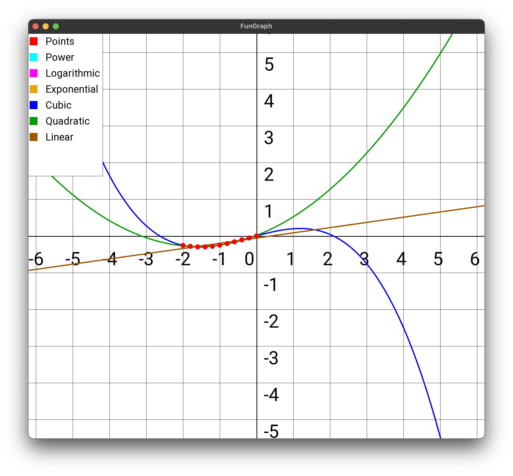

# Лабораторная работа #4
## Цель работы:
Найти функцию, являющуюся наилучшим приближением заданной табличной функции по методу наименьших квадратов.
## Порядок выполнения работы:
### Методика проведения исследования:
- Вычислить меру отклонения: $S=\sum_{i=1}^n\left[\varphi (x_i)-y_i\right]^2$ для всех исследуемых функций;
- Уточнить значения коэффициентов эмпирических функций, минимизируя функцию S;
- Сформировать массивы предполагаемых эмпирических зависимостей $\phi(x_i), \varepsilon$;
- Определить среднеквадратичное отклонение для каждой аппроксимирующей функции. Выбрать наименьшее значение и, следовательно, наилучшее приближение;
- Построить графики полученных эмпирических функций.
### Программная реализация задачи:
- Предусмотреть ввод исходных данных из файла/консоли (таблица $y = f(x)$должна содержать от 8 до 12 точек);
- Реализовать метод наименьших квадратов, исследуя все указанные функции;
- Предусмотреть вывод результатов в файл/консоль: коэффициенты аппроксимирующих функций, среднеквадратичное отклонение, массивы значений $x_i, y_i, \varphi (x_i), \varepsilon_i$ ;
- Для линейной зависимости вычислить коэффициент корреляции Пирсона;
- Программа должна отображать наилучшую аппроксимирующую функцию;
-  Организовать вывод графиков функций, графики должны полностью отображать весь исследуемый интервал (с запасом);
- Программа должна быть протестирована при различных наборах данных, в том числе и некорректных;

## Рабочие формулы используемых методов.
- Линейная функция: $$\varphi (x, a,b) = ax+b$$
- Квадратичная функция: $$\varphi (x, a_0, a_1, a_2) = a_0+a_1x+a_2x^2$$
- Степенная функция: $$\varphi(x) = ax^b$$
- Экспоненциальная функция: $$\varphi(x) = ae^{bx}$$
- Логарифмическая функция: $$\varphi(x) = aln(x)+b$$
- Коэффициент корреляции Пирсона: 
$$r = \frac{\sum \limits_{i=1}^n (x_i - \overline{x})(y_i-\overline{y})}{\sqrt{\sum \limits_{i=1}^n(x_i-\overline{x})^2\sum \limits_{i=1}^n(y_i-\overline{y})^2}}$$
- Среднеквадратичное отклонение:
$$\delta = \sqrt{\frac{\sum\limits_{i=1}^n(\varphi(x_i)-y_i)^2}{n}}$$

## Листинг программы
[-> code](./src/)

## Результаты выполнения программы при различных исходных данных.
### 1
```Do you want to load points from a file? (y/n): y
Enter _filename: test1
Do you want to output to a file? (y/n): n
----------POWER----------
+---------+-----------+------------+------------+------------+
| N p.p.  | xi        | yi         | fi         | ei         | 
+---------+-----------+------------+------------+------------+
| 1       | 1.100000  | 2.730000   | 2.753465   | 0.023465   | 
+---------+-----------+------------+------------+------------+
| 2       | 2.300000  | 5.120000   | 5.108953   | -0.011047  | 
+---------+-----------+------------+------------+------------+
| 3       | 3.700000  | 7.740000   | 7.609647   | -0.130353  | 
+---------+-----------+------------+------------+------------+
| 4       | 4.500000  | 8.910000   | 8.966163   | 0.056163   | 
+---------+-----------+------------+------------+------------+
| 5       | 5.400000  | 10.590000  | 10.446321  | -0.143679  | 
+---------+-----------+------------+------------+------------+
| 6       | 6.800000  | 12.750000  | 12.672535  | -0.077465  | 
+---------+-----------+------------+------------+------------+
| 7       | 7.500000  | 13.430000  | 13.757005  | 0.327005   | 
+---------+-----------+------------+------------+------------+
+-------------------------+-----------+
| Key                     | Value     | 
+-------------------------+-----------+
| Standard Deviation      | 0.148514  | 
+-------------------------+-----------+
| Minimization criterion  | 0.154396  | 
+-------------------------+-----------+
| a0                      | 2.542090  | 
+-------------------------+-----------+
| a1                      | 0.838036  | 
+-------------------------+-----------+
----------LOGARITHMIC----------
+---------+-----------+------------+------------+------------+
| N p.p.  | xi        | yi         | fi         | ei         | 
+---------+-----------+------------+------------+------------+
| 1       | 1.100000  | 2.730000   | 1.737381   | -0.992619  | 
+---------+-----------+------------+------------+------------+
| 2       | 2.300000  | 5.120000   | 5.904843   | 0.784843   | 
+---------+-----------+------------+------------+------------+
| 3       | 3.700000  | 7.740000   | 8.591004   | 0.851004   | 
+---------+-----------+------------+------------+------------+
| 4       | 4.500000  | 8.910000   | 9.696968   | 0.786968   | 
+---------+-----------+------------+------------+------------+
| 5       | 5.400000  | 10.590000  | 10.727092  | 0.137092   | 
+---------+-----------+------------+------------+------------+
| 6       | 6.800000  | 12.750000  | 12.029559  | -0.720441  | 
+---------+-----------+------------+------------+------------+
| 7       | 7.500000  | 13.430000  | 12.583152  | -0.846848  | 
+---------+-----------+------------+------------+------------+
+-------------------------+-----------+
| Key                     | Value     | 
+-------------------------+-----------+
| Standard Deviation      | 0.774576  | 
+-------------------------+-----------+
| Minimization criterion  | 4.199778  | 
+-------------------------+-----------+
| a0                      | 1.198875  | 
+-------------------------+-----------+
| a1                      | 5.650037  | 
+-------------------------+-----------+
----------EXPONENTIAL----------
+---------+-----------+------------+------------+------------+
| N p.p.  | xi        | yi         | fi         | ei         | 
+---------+-----------+------------+------------+------------+
| 1       | 1.100000  | 2.730000   | 3.534788   | 0.804788   | 
+---------+-----------+------------+------------+------------+
| 2       | 2.300000  | 5.120000   | 4.683819   | -0.436181  | 
+---------+-----------+------------+------------+------------+
| 3       | 3.700000  | 7.740000   | 6.504437   | -1.235563  | 
+---------+-----------+------------+------------+------------+
| 4       | 4.500000  | 8.910000   | 7.846950   | -1.063050  | 
+---------+-----------+------------+------------+------------+
| 5       | 5.400000  | 10.590000  | 9.691220   | -0.898780  | 
+---------+-----------+------------+------------+------------+
| 6       | 6.800000  | 12.750000  | 13.458233  | 0.708233   | 
+---------+-----------+------------+------------+------------+
| 7       | 7.500000  | 13.430000  | 15.859622  | 2.429622   | 
+---------+-----------+------------+------------+------------+
+-------------------------+------------+
| Key                     | Value      | 
+-------------------------+------------+
| Standard Deviation      | 1.236764   | 
+-------------------------+------------+
| Minimization criterion  | 10.707090  | 
+-------------------------+------------+
| a0                      | 2.730945   | 
+-------------------------+------------+
| a1                      | 0.234550   | 
+-------------------------+------------+
----------CUBIC----------
+---------+-----------+------------+------------+------------+
| N p.p.  | xi        | yi         | fi         | ei         | 
+---------+-----------+------------+------------+------------+
| 1       | 1.100000  | 2.730000   | 2.757914   | 0.027914   | 
+---------+-----------+------------+------------+------------+
| 2       | 2.300000  | 5.120000   | 5.064653   | -0.055347  | 
+---------+-----------+------------+------------+------------+
| 3       | 3.700000  | 7.740000   | 7.669250   | -0.070750  | 
+---------+-----------+------------+------------+------------+
| 4       | 4.500000  | 8.910000   | 9.079564   | 0.169564   | 
+---------+-----------+------------+------------+------------+
| 5       | 5.400000  | 10.590000  | 10.569680  | -0.020320  | 
+---------+-----------+------------+------------+------------+
| 6       | 6.800000  | 12.750000  | 12.624264  | -0.125736  | 
+---------+-----------+------------+------------+------------+
| 7       | 7.500000  | 13.430000  | 13.504675  | 0.074675   | 
+---------+-----------+------------+------------+------------+
+-------------------------+------------+
| Key                     | Value      | 
+-------------------------+------------+
| Standard Deviation      | 0.092117   | 
+-------------------------+------------+
| Minimization criterion  | 0.059399   | 
+-------------------------+------------+
| a0                      | 0.639772   | 
+-------------------------+------------+
| a1                      | 1.911877   | 
+-------------------------+------------+
| a2                      | 0.019107   | 
+-------------------------+------------+
| a3                      | -0.006042  | 
+-------------------------+------------+
----------QUADRATIC----------
+---------+-----------+------------+------------+------------+
| N p.p.  | xi        | yi         | fi         | ei         | 
+---------+-----------+------------+------------+------------+
| 1       | 1.100000  | 2.730000   | 2.720172   | -0.009828  | 
+---------+-----------+------------+------------+------------+
| 2       | 2.300000  | 5.120000   | 5.116916   | -0.003084  | 
+---------+-----------+------------+------------+------------+
| 3       | 3.700000  | 7.740000   | 7.698891   | -0.041109  | 
+---------+-----------+------------+------------+------------+
| 4       | 4.500000  | 8.910000   | 9.070725   | 0.160725   | 
+---------+-----------+------------+------------+------------+
| 5       | 5.400000  | 10.590000  | 10.523993  | -0.066007  | 
+---------+-----------+------------+------------+------------+
| 6       | 6.800000  | 12.750000  | 12.595125  | -0.154875  | 
+---------+-----------+------------+------------+------------+
| 7       | 7.500000  | 13.430000  | 13.544178  | 0.114178   | 
+---------+-----------+------------+------------+------------+
+-------------------------+------------+
| Key                     | Value      | 
+-------------------------+------------+
| Standard Deviation      | 0.099289   | 
+-------------------------+------------+
| Minimization criterion  | 0.069008   | 
+-------------------------+------------+
| a0                      | 0.374260   | 
+-------------------------+------------+
| a1                      | 2.197386   | 
+-------------------------+------------+
| a2                      | -0.058853  | 
+-------------------------+------------+
----------LINEAR----------
+---------+-----------+------------+------------+------------+
| N p.p.  | xi        | yi         | fi         | ei         | 
+---------+-----------+------------+------------+------------+
| 1       | 1.100000  | 2.730000   | 3.070710   | 0.340710   | 
+---------+-----------+------------+------------+------------+
| 2       | 2.300000  | 5.120000   | 5.093169   | -0.026831  | 
+---------+-----------+------------+------------+------------+
| 3       | 3.700000  | 7.740000   | 7.452705   | -0.287295  | 
+---------+-----------+------------+------------+------------+
| 4       | 4.500000  | 8.910000   | 8.801011   | -0.108989  | 
+---------+-----------+------------+------------+------------+
| 5       | 5.400000  | 10.590000  | 10.317855  | -0.272145  | 
+---------+-----------+------------+------------+------------+
| 6       | 6.800000  | 12.750000  | 12.677391  | -0.072609  | 
+---------+-----------+------------+------------+------------+
| 7       | 7.500000  | 13.430000  | 13.857159  | 0.427159   | 
+---------+-----------+------------+------------+------------+
+----------------------------------+-----------+
| Key                              | Value     | 
+----------------------------------+-----------+
| Pearson Correlation Coefficient  | 0.997419  | 
+----------------------------------+-----------+
| Standard Deviation               | 0.259950  | 
+----------------------------------+-----------+
| Minimization criterion           | 0.473020  | 
+----------------------------------+-----------+
| a0                               | 1.216788  | 
+----------------------------------+-----------+
| a1                               | 1.685383  | 
+----------------------------------+-----------+
----------BEST APPROXIMATION----------
Best approximation: Cubic
Standard Deviation: 0.0921169
```


### 2
```Do you want to load points from a file? (y/n): y
Enter _filename: test2
Do you want to output to a file? (y/n): n
----------POWER----------
+---------+------------+------------+------+------+
| N p.p.  | xi         | yi         | fi   | ei   | 
+---------+------------+------------+------+------+
| 1       | -2.000000  | -0.258000  | nan  | nan  | 
+---------+------------+------------+------+------+
| 2       | -1.800000  | -0.282000  | nan  | nan  | 
+---------+------------+------------+------+------+
| 3       | -1.600000  | -0.297000  | nan  | nan  | 
+---------+------------+------------+------+------+
| 4       | -1.400000  | -0.297000  | nan  | nan  | 
+---------+------------+------------+------+------+
| 5       | -1.200000  | -0.281000  | nan  | nan  | 
+---------+------------+------------+------+------+
| 6       | -1.000000  | -0.250000  | nan  | nan  | 
+---------+------------+------------+------+------+
| 7       | -0.800000  | -0.208000  | nan  | nan  | 
+---------+------------+------------+------+------+
| 8       | -0.600000  | -0.159000  | nan  | nan  | 
+---------+------------+------------+------+------+
| 9       | -0.400000  | -0.106000  | nan  | nan  | 
+---------+------------+------------+------+------+
| 10      | -0.200000  | -0.053000  | nan  | nan  | 
+---------+------------+------------+------+------+
| 11      | 0.000000   | 0.000000   | nan  | nan  | 
+---------+------------+------------+------+------+
+-------------------------+--------+
| Key                     | Value  | 
+-------------------------+--------+
| Standard Deviation      | nan    | 
+-------------------------+--------+
| Minimization criterion  | nan    | 
+-------------------------+--------+
| a0                      | nan    | 
+-------------------------+--------+
| a1                      | nan    | 
+-------------------------+--------+
----------LOGARITHMIC----------
+---------+------------+------------+------+------+
| N p.p.  | xi         | yi         | fi   | ei   | 
+---------+------------+------------+------+------+
| 1       | -2.000000  | -0.258000  | nan  | nan  | 
+---------+------------+------------+------+------+
| 2       | -1.800000  | -0.282000  | nan  | nan  | 
+---------+------------+------------+------+------+
| 3       | -1.600000  | -0.297000  | nan  | nan  | 
+---------+------------+------------+------+------+
| 4       | -1.400000  | -0.297000  | nan  | nan  | 
+---------+------------+------------+------+------+
| 5       | -1.200000  | -0.281000  | nan  | nan  | 
+---------+------------+------------+------+------+
| 6       | -1.000000  | -0.250000  | nan  | nan  | 
+---------+------------+------------+------+------+
| 7       | -0.800000  | -0.208000  | nan  | nan  | 
+---------+------------+------------+------+------+
| 8       | -0.600000  | -0.159000  | nan  | nan  | 
+---------+------------+------------+------+------+
| 9       | -0.400000  | -0.106000  | nan  | nan  | 
+---------+------------+------------+------+------+
| 10      | -0.200000  | -0.053000  | nan  | nan  | 
+---------+------------+------------+------+------+
| 11      | 0.000000   | 0.000000   | nan  | nan  | 
+---------+------------+------------+------+------+
+-------------------------+--------+
| Key                     | Value  | 
+-------------------------+--------+
| Standard Deviation      | nan    | 
+-------------------------+--------+
| Minimization criterion  | nan    | 
+-------------------------+--------+
| a0                      | nan    | 
+-------------------------+--------+
| a1                      | nan    | 
+-------------------------+--------+
----------EXPONENTIAL----------
+---------+------------+------------+------+------+
| N p.p.  | xi         | yi         | fi   | ei   | 
+---------+------------+------------+------+------+
| 1       | -2.000000  | -0.258000  | nan  | nan  | 
+---------+------------+------------+------+------+
| 2       | -1.800000  | -0.282000  | nan  | nan  | 
+---------+------------+------------+------+------+
| 3       | -1.600000  | -0.297000  | nan  | nan  | 
+---------+------------+------------+------+------+
| 4       | -1.400000  | -0.297000  | nan  | nan  | 
+---------+------------+------------+------+------+
| 5       | -1.200000  | -0.281000  | nan  | nan  | 
+---------+------------+------------+------+------+
| 6       | -1.000000  | -0.250000  | nan  | nan  | 
+---------+------------+------------+------+------+
| 7       | -0.800000  | -0.208000  | nan  | nan  | 
+---------+------------+------------+------+------+
| 8       | -0.600000  | -0.159000  | nan  | nan  | 
+---------+------------+------------+------+------+
| 9       | -0.400000  | -0.106000  | nan  | nan  | 
+---------+------------+------------+------+------+
| 10      | -0.200000  | -0.053000  | nan  | nan  | 
+---------+------------+------------+------+------+
| 11      | 0.000000   | 0.000000   | nan  | nan  | 
+---------+------------+------------+------+------+
+-------------------------+--------+
| Key                     | Value  | 
+-------------------------+--------+
| Standard Deviation      | nan    | 
+-------------------------+--------+
| Minimization criterion  | nan    | 
+-------------------------+--------+
| a0                      | nan    | 
+-------------------------+--------+
| a1                      | nan    | 
+-------------------------+--------+
----------CUBIC----------
+---------+------------+------------+------------+------------+
| N p.p.  | xi         | yi         | fi         | ei         | 
+---------+------------+------------+------------+------------+
| 1       | -2.000000  | -0.258000  | -0.254427  | 0.003573   | 
+---------+------------+------------+------------+------------+
| 2       | -1.800000  | -0.282000  | -0.286678  | -0.004678  | 
+---------+------------+------------+------------+------------+
| 3       | -1.600000  | -0.297000  | -0.299760  | -0.002760  | 
+---------+------------+------------+------------+------------+
| 4       | -1.400000  | -0.297000  | -0.296040  | 0.000960   | 
+---------+------------+------------+------------+------------+
| 5       | -1.200000  | -0.281000  | -0.277886  | 0.003114   | 
+---------+------------+------------+------------+------------+
| 6       | -1.000000  | -0.250000  | -0.247667  | 0.002333   | 
+---------+------------+------------+------------+------------+
| 7       | -0.800000  | -0.208000  | -0.207751  | 0.000249   | 
+---------+------------+------------+------------+------------+
| 8       | -0.600000  | -0.159000  | -0.160506  | -0.001506  | 
+---------+------------+------------+------------+------------+
| 9       | -0.400000  | -0.106000  | -0.108301  | -0.002301  | 
+---------+------------+------------+------------+------------+
| 10      | -0.200000  | -0.053000  | -0.053503  | -0.000503  | 
+---------+------------+------------+------------+------------+
| 11      | 0.000000   | 0.000000   | 0.001517   | 0.001517   | 
+---------+------------+------------+------------+------------+
+-------------------------+------------+
| Key                     | Value      | 
+-------------------------+------------+
| Standard Deviation      | 0.002496   | 
+-------------------------+------------+
| Minimization criterion  | 0.000069   | 
+-------------------------+------------+
| a0                      | 0.001517   | 
+-------------------------+------------+
| a1                      | 0.271717   | 
+-------------------------+------------+
| a2                      | -0.026807  | 
+-------------------------+------------+
| a3                      | -0.049340  | 
+-------------------------+------------+
----------QUADRATIC----------
+---------+------------+------------+------------+------------+
| N p.p.  | xi         | yi         | fi         | ei         | 
+---------+------------+------------+------------+------------+
| 1       | -2.000000  | -0.258000  | -0.268636  | -0.010636  | 
+---------+------------+------------+------------+------------+
| 2       | -1.800000  | -0.282000  | -0.283836  | -0.001836  | 
+---------+------------+------------+------------+------------+
| 3       | -1.600000  | -0.297000  | -0.289339  | 0.007661   | 
+---------+------------+------------+------------+------------+
| 4       | -1.400000  | -0.297000  | -0.285145  | 0.011855   | 
+---------+------------+------------+------------+------------+
| 5       | -1.200000  | -0.281000  | -0.271255  | 0.009745   | 
+---------+------------+------------+------------+------------+
| 6       | -1.000000  | -0.250000  | -0.247667  | 0.002333   | 
+---------+------------+------------+------------+------------+
| 7       | -0.800000  | -0.208000  | -0.214382  | -0.006382  | 
+---------+------------+------------+------------+------------+
| 8       | -0.600000  | -0.159000  | -0.171400  | -0.012400  | 
+---------+------------+------------+------------+------------+
| 9       | -0.400000  | -0.106000  | -0.118721  | -0.012721  | 
+---------+------------+------------+------------+------------+
| 10      | -0.200000  | -0.053000  | -0.056345  | -0.003345  | 
+---------+------------+------------+------------+------------+
| 11      | 0.000000   | 0.000000   | 0.015727   | 0.015727   | 
+---------+------------+------------+------------+------------+
+-------------------------+-----------+
| Key                     | Value     | 
+-------------------------+-----------+
| Standard Deviation      | 0.009681  | 
+-------------------------+-----------+
| Minimization criterion  | 0.001031  | 
+-------------------------+-----------+
| a0                      | 0.015727  | 
+-------------------------+-----------+
| a1                      | 0.384606  | 
+-------------------------+-----------+
| a2                      | 0.121212  | 
+-------------------------+-----------+
----------LINEAR----------
+---------+------------+------------+------------+------------+
| N p.p.  | xi         | yi         | fi         | ei         | 
+---------+------------+------------+------------+------------+
| 1       | -2.000000  | -0.258000  | -0.341364  | -0.083364  | 
+---------+------------+------------+------------+------------+
| 2       | -1.800000  | -0.282000  | -0.312927  | -0.030927  | 
+---------+------------+------------+------------+------------+
| 3       | -1.600000  | -0.297000  | -0.284491  | 0.012509   | 
+---------+------------+------------+------------+------------+
| 4       | -1.400000  | -0.297000  | -0.256055  | 0.040945   | 
+---------+------------+------------+------------+------------+
| 5       | -1.200000  | -0.281000  | -0.227618  | 0.053382   | 
+---------+------------+------------+------------+------------+
| 6       | -1.000000  | -0.250000  | -0.199182  | 0.050818   | 
+---------+------------+------------+------------+------------+
| 7       | -0.800000  | -0.208000  | -0.170745  | 0.037255   | 
+---------+------------+------------+------------+------------+
| 8       | -0.600000  | -0.159000  | -0.142309  | 0.016691   | 
+---------+------------+------------+------------+------------+
| 9       | -0.400000  | -0.106000  | -0.113873  | -0.007873  | 
+---------+------------+------------+------------+------------+
| 10      | -0.200000  | -0.053000  | -0.085436  | -0.032436  | 
+---------+------------+------------+------------+------------+
| 11      | 0.000000   | 0.000000   | -0.057000  | -0.057000  | 
+---------+------------+------------+------------+------------+
+----------------------------------+------------+
| Key                              | Value      | 
+----------------------------------+------------+
| Pearson Correlation Coefficient  | 0.898626   | 
+----------------------------------+------------+
| Standard Deviation               | 0.043901   | 
+----------------------------------+------------+
| Minimization criterion           | 0.021201   | 
+----------------------------------+------------+
| a0                               | -0.057000  | 
+----------------------------------+------------+
| a1                               | 0.142182   | 
+----------------------------------+------------+
----------BEST APPROXIMATION----------
Best approximation: Cubic
Standard Deviation: 0.00249577
```


```
Do you want to load points from a file? (y/n): n
Enter number of points: 11
Enter x and y for point 1: 0 0
Enter x and y for point 2: 0.2 2.396
Enter x and y for point 3: 0.4 4.680
Enter x and y for point 4: 0.6 6.374
Enter x and y for point 5: 0.8 6.810
Enter x and y for point 6: 1 6
Enter x and y for point 7: 1.2 4.685
Enter x and y for point 8: 1.4 3.470
Enter x and y for point 9: 1.6 2.542
Enter x and y for point 10: 1.8 1.879
Enter x and y for point 11: 2 1.412
Do you want to output to a file? (y/n): n
----------POWER----------
+---------+-----------+-----------+------+------+
| N p.p.  | xi        | yi        | fi   | ei   | 
+---------+-----------+-----------+------+------+
| 1       | 0.000000  | 0.000000  | nan  | nan  | 
+---------+-----------+-----------+------+------+
| 2       | 0.200000  | 2.396000  | nan  | nan  | 
+---------+-----------+-----------+------+------+
| 3       | 0.400000  | 4.680000  | nan  | nan  | 
+---------+-----------+-----------+------+------+
| 4       | 0.600000  | 6.374000  | nan  | nan  | 
+---------+-----------+-----------+------+------+
| 5       | 0.800000  | 6.810000  | nan  | nan  | 
+---------+-----------+-----------+------+------+
| 6       | 1.000000  | 6.000000  | nan  | nan  | 
+---------+-----------+-----------+------+------+
| 7       | 1.200000  | 4.685000  | nan  | nan  | 
+---------+-----------+-----------+------+------+
| 8       | 1.400000  | 3.470000  | nan  | nan  | 
+---------+-----------+-----------+------+------+
| 9       | 1.600000  | 2.542000  | nan  | nan  | 
+---------+-----------+-----------+------+------+
| 10      | 1.800000  | 1.879000  | nan  | nan  | 
+---------+-----------+-----------+------+------+
| 11      | 2.000000  | 1.412000  | nan  | nan  | 
+---------+-----------+-----------+------+------+
+-------------------------+--------+
| Key                     | Value  | 
+-------------------------+--------+
| Standard Deviation      | nan    | 
+-------------------------+--------+
| Minimization criterion  | nan    | 
+-------------------------+--------+
| a0                      | nan    | 
+-------------------------+--------+
| a1                      | nan    | 
+-------------------------+--------+
----------LOGARITHMIC----------
+---------+-----------+-----------+------+------+
| N p.p.  | xi        | yi        | fi   | ei   | 
+---------+-----------+-----------+------+------+
| 1       | 0.000000  | 0.000000  | nan  | nan  | 
+---------+-----------+-----------+------+------+
| 2       | 0.200000  | 2.396000  | nan  | nan  | 
+---------+-----------+-----------+------+------+
| 3       | 0.400000  | 4.680000  | nan  | nan  | 
+---------+-----------+-----------+------+------+
| 4       | 0.600000  | 6.374000  | nan  | nan  | 
+---------+-----------+-----------+------+------+
| 5       | 0.800000  | 6.810000  | nan  | nan  | 
+---------+-----------+-----------+------+------+
| 6       | 1.000000  | 6.000000  | nan  | nan  | 
+---------+-----------+-----------+------+------+
| 7       | 1.200000  | 4.685000  | nan  | nan  | 
+---------+-----------+-----------+------+------+
| 8       | 1.400000  | 3.470000  | nan  | nan  | 
+---------+-----------+-----------+------+------+
| 9       | 1.600000  | 2.542000  | nan  | nan  | 
+---------+-----------+-----------+------+------+
| 10      | 1.800000  | 1.879000  | nan  | nan  | 
+---------+-----------+-----------+------+------+
| 11      | 2.000000  | 1.412000  | nan  | nan  | 
+---------+-----------+-----------+------+------+
+-------------------------+--------+
| Key                     | Value  | 
+-------------------------+--------+
| Standard Deviation      | nan    | 
+-------------------------+--------+
| Minimization criterion  | nan    | 
+-------------------------+--------+
| a0                      | nan    | 
+-------------------------+--------+
| a1                      | nan    | 
+-------------------------+--------+
----------EXPONENTIAL----------
+---------+-----------+-----------+------+------+
| N p.p.  | xi        | yi        | fi   | ei   | 
+---------+-----------+-----------+------+------+
| 1       | 0.000000  | 0.000000  | nan  | nan  | 
+---------+-----------+-----------+------+------+
| 2       | 0.200000  | 2.396000  | nan  | nan  | 
+---------+-----------+-----------+------+------+
| 3       | 0.400000  | 4.680000  | nan  | nan  | 
+---------+-----------+-----------+------+------+
| 4       | 0.600000  | 6.374000  | nan  | nan  | 
+---------+-----------+-----------+------+------+
| 5       | 0.800000  | 6.810000  | nan  | nan  | 
+---------+-----------+-----------+------+------+
| 6       | 1.000000  | 6.000000  | nan  | nan  | 
+---------+-----------+-----------+------+------+
| 7       | 1.200000  | 4.685000  | nan  | nan  | 
+---------+-----------+-----------+------+------+
| 8       | 1.400000  | 3.470000  | nan  | nan  | 
+---------+-----------+-----------+------+------+
| 9       | 1.600000  | 2.542000  | nan  | nan  | 
+---------+-----------+-----------+------+------+
| 10      | 1.800000  | 1.879000  | nan  | nan  | 
+---------+-----------+-----------+------+------+
| 11      | 2.000000  | 1.412000  | nan  | nan  | 
+---------+-----------+-----------+------+------+
+-------------------------+--------+
| Key                     | Value  | 
+-------------------------+--------+
| Standard Deviation      | nan    | 
+-------------------------+--------+
| Minimization criterion  | nan    | 
+-------------------------+--------+
| a0                      | nan    | 
+-------------------------+--------+
| a1                      | nan    | 
+-------------------------+--------+
----------CUBIC----------
+---------+-----------+-----------+------------+------------+
| N p.p.  | xi        | yi        | fi         | ei         | 
+---------+-----------+-----------+------------+------------+
| 1       | 0.000000  | 0.000000  | -0.435566  | -0.435566  | 
+---------+-----------+-----------+------------+------------+
| 2       | 0.200000  | 2.396000  | 2.984385   | 0.588385   | 
+---------+-----------+-----------+------------+------------+
| 3       | 0.400000  | 4.680000  | 5.096664   | 0.416664   | 
+---------+-----------+-----------+------------+------------+
| 4       | 0.600000  | 6.374000  | 6.121599   | -0.252401  | 
+---------+-----------+-----------+------------+------------+
| 5       | 0.800000  | 6.810000  | 6.279515   | -0.530485  | 
+---------+-----------+-----------+------------+------------+
| 6       | 1.000000  | 6.000000  | 5.790739   | -0.209261  | 
+---------+-----------+-----------+------------+------------+
| 7       | 1.200000  | 4.685000  | 4.875597   | 0.190597   | 
+---------+-----------+-----------+------------+------------+
| 8       | 1.400000  | 3.470000  | 3.754415   | 0.284415   | 
+---------+-----------+-----------+------------+------------+
| 9       | 1.600000  | 2.542000  | 2.647520   | 0.105520   | 
+---------+-----------+-----------+------------+------------+
| 10      | 1.800000  | 1.879000  | 1.775238   | -0.103762  | 
+---------+-----------+-----------+------------+------------+
| 11      | 2.000000  | 1.412000  | 1.357895   | -0.054105  | 
+---------+-----------+-----------+------------+------------+
+-------------------------+-------------+
| Key                     | Value       | 
+-------------------------+-------------+
| Standard Deviation      | 0.335814    | 
+-------------------------+-------------+
| Minimization criterion  | 1.240482    | 
+-------------------------+-------------+
| a0                      | -0.435566   | 
+-------------------------+-------------+
| a1                      | 20.736144   | 
+-------------------------+-------------+
| a2                      | -19.099971  | 
+-------------------------+-------------+
| a3                      | 4.590132    | 
+-------------------------+-------------+
----------QUADRATIC----------
+---------+-----------+-----------+-----------+------------+
| N p.p.  | xi        | yi        | fi        | ei         | 
+---------+-----------+-----------+-----------+------------+
| 1       | 0.000000  | 0.000000  | 0.886392  | 0.886392   | 
+---------+-----------+-----------+-----------+------------+
| 2       | 0.200000  | 2.396000  | 2.719993  | 0.323993   | 
+---------+-----------+-----------+-----------+------------+
| 3       | 0.400000  | 4.680000  | 4.127228  | -0.552772  | 
+---------+-----------+-----------+-----------+------------+
| 4       | 0.600000  | 6.374000  | 5.108098  | -1.265902  | 
+---------+-----------+-----------+-----------+------------+
| 5       | 0.800000  | 6.810000  | 5.662601  | -1.147399  | 
+---------+-----------+-----------+-----------+------------+
| 6       | 1.000000  | 6.000000  | 5.790739  | -0.209261  | 
+---------+-----------+-----------+-----------+------------+
| 7       | 1.200000  | 4.685000  | 5.492510  | 0.807510   | 
+---------+-----------+-----------+-----------+------------+
| 8       | 1.400000  | 3.470000  | 4.767916  | 1.297916   | 
+---------+-----------+-----------+-----------+------------+
| 9       | 1.600000  | 2.542000  | 3.616956  | 1.074956   | 
+---------+-----------+-----------+-----------+------------+
| 10      | 1.800000  | 1.879000  | 2.039629  | 0.160629   | 
+---------+-----------+-----------+-----------+------------+
| 11      | 2.000000  | 1.412000  | 0.035937  | -1.376063  | 
+---------+-----------+-----------+-----------+------------+
+-------------------------+------------+
| Key                     | Value      | 
+-------------------------+------------+
| Standard Deviation      | 0.932766   | 
+-------------------------+------------+
| Minimization criterion  | 9.570580   | 
+-------------------------+------------+
| a0                      | 0.886392   | 
+-------------------------+------------+
| a1                      | 10.233922  | 
+-------------------------+------------+
| a2                      | -5.329575  | 
+-------------------------+------------+
----------LINEAR----------
+---------+-----------+-----------+-----------+------------+
| N p.p.  | xi        | yi        | fi        | ei         | 
+---------+-----------+-----------+-----------+------------+
| 1       | 0.000000  | 0.000000  | 4.084136  | 4.084136   | 
+---------+-----------+-----------+-----------+------------+
| 2       | 0.200000  | 2.396000  | 3.999091  | 1.603091   | 
+---------+-----------+-----------+-----------+------------+
| 3       | 0.400000  | 4.680000  | 3.914045  | -0.765955  | 
+---------+-----------+-----------+-----------+------------+
| 4       | 0.600000  | 6.374000  | 3.829000  | -2.545000  | 
+---------+-----------+-----------+-----------+------------+
| 5       | 0.800000  | 6.810000  | 3.743955  | -3.066045  | 
+---------+-----------+-----------+-----------+------------+
| 6       | 1.000000  | 6.000000  | 3.658909  | -2.341091  | 
+---------+-----------+-----------+-----------+------------+
| 7       | 1.200000  | 4.685000  | 3.573864  | -1.111136  | 
+---------+-----------+-----------+-----------+------------+
| 8       | 1.400000  | 3.470000  | 3.488818  | 0.018818   | 
+---------+-----------+-----------+-----------+------------+
| 9       | 1.600000  | 2.542000  | 3.403773  | 0.861773   | 
+---------+-----------+-----------+-----------+------------+
| 10      | 1.800000  | 1.879000  | 3.318727  | 1.439727   | 
+---------+-----------+-----------+-----------+------------+
| 11      | 2.000000  | 1.412000  | 3.233682  | 1.821682   | 
+---------+-----------+-----------+-----------+------------+
+----------------------------------+------------+
| Key                              | Value      | 
+----------------------------------+------------+
| Pearson Correlation Coefficient  | -0.126958  | 
+----------------------------------+------------+
| Standard Deviation               | 2.101171   | 
+----------------------------------+------------+
| Minimization criterion           | 48.564093  | 
+----------------------------------+------------+
| a0                               | 4.084136   | 
+----------------------------------+------------+
| a1                               | -0.425227  | 
+----------------------------------+------------+
----------BEST APPROXIMATION----------
Best approximation: Cubic
Standard Deviation: 0.335814
```
